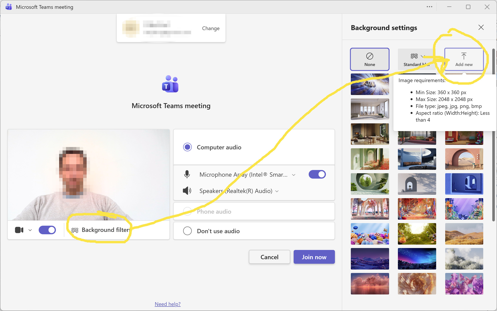
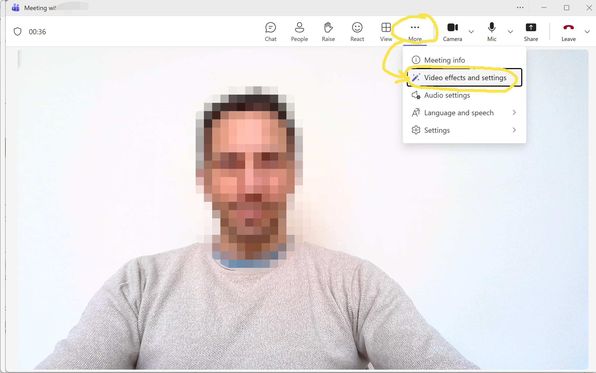
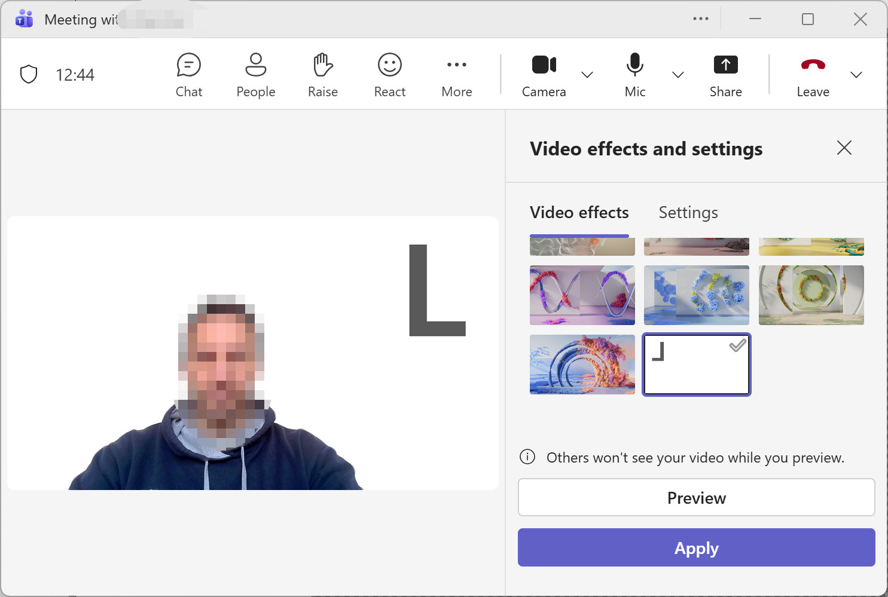

# Scrum poker cards for MS Teams

Use these images as a background in Microsoft Teams calls to indicate how complex (big) a task is.

Folder `./t-shirts` contains cards of T-shirt sizes from XXS to XXL, ?, and a T for tea/coffee break.

Folder `./fib` contains cards of 10, 1, 2, 3, 5, 8, 13, ?, and T for tea/coffee break.

## How to use

How to 'upload' the images as custom Microsoft Teams may vary depending on your settings or settings of your organization. The following steps should work in most cases though.

Copy the png images from this repo to your Microsoft Teams background folder `%LocalAppData%\Packages\MSTeams_8wekyb3d8bbwe\LocalCache\Microsoft\MSTeams\Backgrounds\Uploads` (or search latest Microsoft Teams documentation)

If you cannot locate the folder where Microsoft Teams takes the background images from, you will need to upload the images one-by-one as indicated in the image below. You only need to do this once, Teams will remember these in future meetings.

# About story pointing
Story pointing is often used in agile development to estimate *relative* complexity of implementing certain user stories or other work items. The assigned story points should indicate how complex an implementation is considering factors such as complexity of the business logic to implement, uncertainty, risks, unknowns, or potential blockers and dependencies. The assessment is relative to other work items the team has assessed.

Sometimes, story points are misinterpreted as number of hours or days a certain work item will take to complete. Such mis-use will likely cause frustration on all sides of an agile team and beyond. The capacity of an agile team to handle certain number of story points becomes apparent only after several iterations (sprints) and is expressed as the team's velocity.
